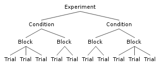

Tribulations: The Online Experiment Runner
============

Tribulations is a Javascript library for [Marionette](http://marionettejs.com/) that does away with boilerplate display logic of instructions and experimental tasks in remote experiments.

This library is designed and developed with researchers of human-computer interaction in mind.

Demo and Documentation
-----------
See the [demo](TODO) and [documentation](TODO).

When should I use Tribulations?
------------
You should use Tribulations when your **experimental structure can be expressed by a tree**. For example, consider evaluating the performance of multiple clicking tools ( *conditions* ). In each condition, there are multiple *blocks*, and in each block, there are multiple *trials*.

Aside from the assumption that your experimental structure follows a tree with leaves at equal depth, **Tribulations makes no assumptions about the content of your experiment**. 

Prerequisites
-------------

Tribulations uses Marionette, a popular Javascript MV\* framework built on Backbone.js. 

* [Marionette.js](http://marionettejs.com)
  * [jQuery](http://jquery.com)
  * [Backbone.js](http://backbonejs.org/)
  * [Underscore.js](http://underscorejs.org/)

Contributing
-------------
Install [npm](https://npmjs.org/) and run `npm install`. To run the tests, install [PhantomJS](http://phantomjs.org/).  

To compile and test, run `grunt`.

