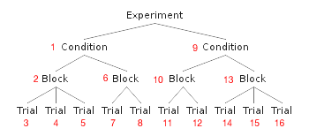

**No more transition boilerplate.** Just provide data, templates, and semantic events to get an experiment running.

```javascript
// Configure our experiment with our experimental structure and DOM templates
var experimentRunnerView = new Tribulations.ExperimentRunnerView({
  experimentStructure: myExperimentalStructure
  subviewClasses: [ConditionSectionView, BlockSectionView, TrialSectionView]
  regionElement: "#experiment-region"
  template: "#runner-template"
});

// Begin the experiment!
App.mainRegion.show(experimentRunnerView);
```

When should I use Tribulations?
------------
You should use Tribulations when your **experimental design can be expressed by depth-first search of a tree**. For example, consider evaluating the performance of *conditions*. In each condition, there are multiple *blocks*, and in each block, there are multiple *trials*.



Aside from the assumption that your experimental structure follows a tree with leaves at equal depth, **Tribulations makes no assumptions about the content of your experiment**. 

Dependencies
-------------

Tribulations uses Marionette, a popular Javascript MV\* framework built on Backbone.js. 

* [Marionette.js](http://marionettejs.com)
  * [jQuery](http://jquery.com)
  * [Backbone.js](http://backbonejs.org/)
  * [Underscore.js](http://underscorejs.org/)

# Demo
This demo illustrates a simple experiment in which the user is asked to click on numbers. In the tutorial, we'll later see that the code for the demo has **no transition boilerplate code**. 

```javascript
var EXPERIMENT = {
  firstCondition: [
    [1, 2, 3],  // first block and three trials
    [4, 5],     // second block and two trials
    [6]        // etc.
  ],
  secondCondition: [
    [7, 8, 9],
    [8, 7]
  ]
};
```




# Usage

Tribulations only exports two classes: 

1. `Tribulations.ExperimentRunnerView`: renders the views in the proper order, subclasses [`Marionette.Layout`](https://github.com/marionettejs/backbone.marionette/blob/master/docs/marionette.layout.md) that 
2. `Tribulations.Node`: a node object for constructing a tree, subclasses [`Backbone.Model`](http://backbonejs.org/#Model) and expects two relevant properties: `innerModel` and `children`

**NOTE**: This documentation assumes some knowledge of [Marionette](http://marionettejs.com/). 

# Tutorial
You should provide your own experimental structure for steps 1 to 3. In the tutorial below, we will use a simple experiment with three levels of the experimental tree: conditions, blocks, and trials.

## Experimental Structure
Suppose we have the following experiment, where users are asked to click numbers under various conditions:

    ```javascript
    var EXPERIMENT = {
      firstCondition: [
        [1, 2, 3],  // first block and three trials
        [4, 5],     // second block and two trials
        [6]        // etc.
      ],
      secondCondition: [
        [7, 8, 9],
        [8, 7]
      ]
    };
    ```

## Scaffolding

### 1. Create view classes and templates for each level of the tree. 

These classes should be subclasses of [`Marionette.View`](https://github.com/marionettejs/backbone.marionette/tree/master/docs) for each level of the experimental tree. (Recall that in Javascript MV\* frameworks, views are actually more akin to the controllers of traditional MVC, containing more application logic).

    ```javascript
    // helper for click events
    var endOnClickEvents = {
        click: function() {
            // Helper: triggers an event for the end of an experimental section
            this.trigger("runner:sectionEnd"); 
        }
    };

    var ConditionView = Marionette.ItemView.extend({
        template: "#condition-template",
        events: endOnClickEvents
    });

    var BlockView = Marionette.ItemView.extend({
        template: "#block-template",
        events: endOnClickEvents
    });

    var TrialView = Marionette.ItemView.extend({
        template: "#trial-template",
        events: endOnClickEvents
    });

    // our model
    var NumberTask = Backbone.Model.extend({
        initialize: function() {
          // do something interesting with this model
        }
    });
    ```

    ```
    <!-- Marionette templates -->
    <script id="runner-template" type="text/html">
      <div id="experiment-region" class="experiment-region"></div>
    </script>

    <script id="condition-template" type="text/html">
      Include instructions for the conditions here.
    </script>

    <script id="block-template" type="text/html">
      Include your block level text here.
    </script>

    <script id="trial-template" type="text/html">
      <%- number %>  <!-- access the number passed down from the model -->
    </script>
    ```
### 2. Convert the experimental structure into a tree.
Instantiate `Tribulations.NodeModel` objects (nodes containing model objects) optionally passing down an `innerModel` model (JSON or `Backbone.Model`) and setting `children` that will eventually be rendered in the view. Be careful, as **this section will different drastically depending on the experiment.**

    ```javascript
    // Create a tree from the experimental structure using Tribulations.Node
    var root = new Tribulations.NodeModel();

    // Set the children of the root node to our tree, with
    // conditions at the top level
    root.set("children", _.map(EXPERIMENT, function(value, key) {
        var conditionName = key;
        var blocks = value;
        var conditionNode = new Tribulations.NodeModel({
            innerModel: { name: conditionName }
        });

        // In each condition, create nodes for the blocks
        conditionNode.set("children", _.map(blocks, function(currentBlock) {
            var blockNode = new Tribulations.NodeModel({
                // no innerModel, since it has no metadata

                // Add each trial to the node for the current block
                children: _.map(currentBlock, function(trialDigit) {
                    return new Tribulations.NodeModel({
                        innerModel: new NumberTask({ number: trialDigit })
                    });
                })
            }); 

            return blockNode;
        }));

        return conditionNode;
    }));
    ```

### 3. Create a DOM element for the experiment. 
The name of the template and the region can be anything -- they will be passed into a view later.

    ```html
    <script id="runner-template" type="text/html">
      <div id="#experiment-region">
      </div>
    </script>
    ``` 

### 4. Run the experiment
Initialize a `Tribulations.ExperimentRunnerView` with your experimental structure. Once you show this view in Marionette, the experiment will begin.

    ```javascript
    var experimentRunnerView = new Tribulations.ExperimentRunnerView({
        experimentStructure: experimentStructure
        subviewClasses: [ConditionView, BlockView, TrialView],
        regionElement: "#experiment-region"
        template: "#runner-template"
    });

    // Starts the experiment on the first condition
    App.mainRegion.show(experimentRunnerView);
    ```

## Helpers and Metadata

## Other examples
Include one with practice / reality

